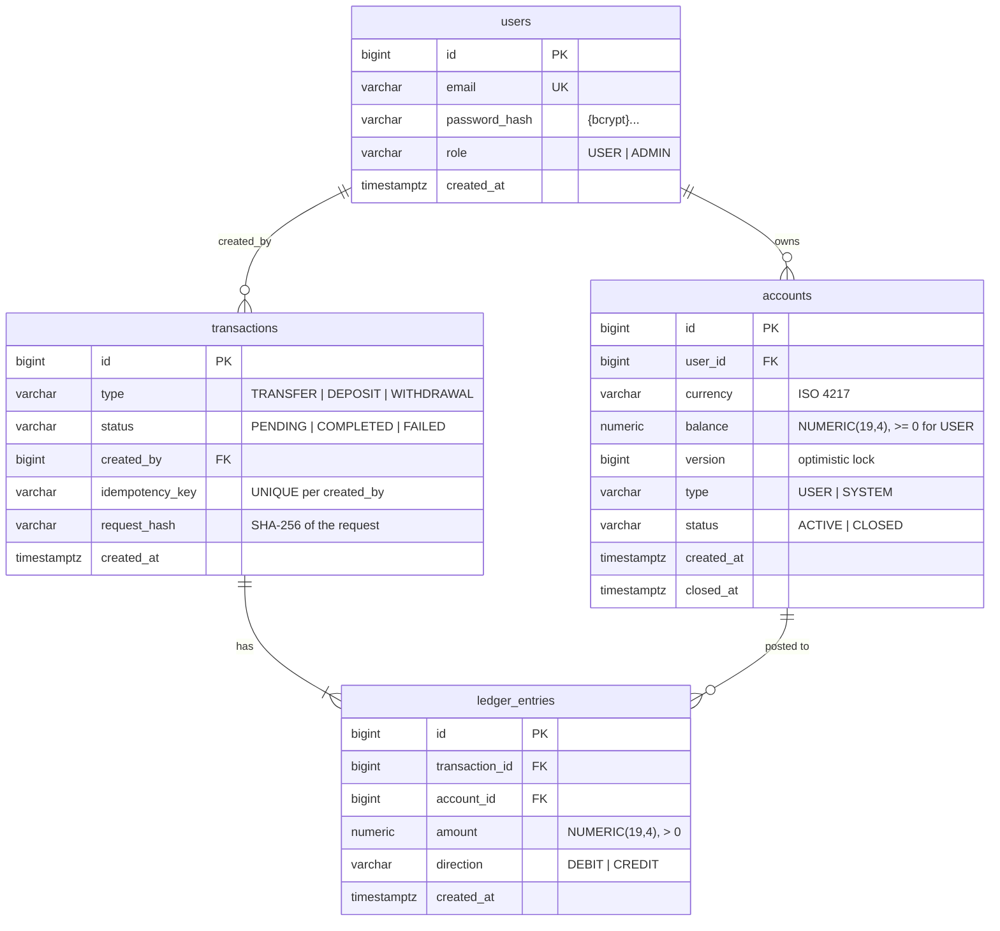

# Esep API

[](https://github.com/Bakhyzh/esep-api/actions/workflows/ci.yml)

Wallets and money transfers on a **double-entry ledger**, with JWT security, SQL spending analytics,
a Redis report cache and Kafka notifications through a Transactional Outbox.
A portfolio project focused on the things that break in real payment systems:
money precision, race conditions, deadlocks, duplicate requests, lost events and access control.

**Stack:** Java 21 · Spring Boot 4.1 · Spring Data JPA (Hibernate 7) · PostgreSQL 17 · Flyway ·
Spring Security (JWT resource server) · Redis · Kafka (KRaft) · springdoc OpenAPI · JUnit 5 · Mockito ·
Testcontainers · Docker Compose · GitHub Actions

## Quick start

```bash
docker compose up --build
```

Starts PostgreSQL, Redis, Kafka and the app.

| What | URL |
|---|---|
| Swagger UI | http://localhost:8081/swagger-ui.html |
| OpenAPI JSON | http://localhost:8081/v3/api-docs |
| Health | http://localhost:8081/actuator/health |

Demo users (created by the `dev` profile seed, password `password123`):

| Email | Role |
|---|---|
| `alice@esep.dev` | USER |
| `bob@esep.dev` | USER |
| `admin@esep.dev` | ADMIN |

If port 8081 is busy: `APP_PORT=8085 docker compose up --build`.

### Try it with curl

```bash
# log in
ALICE=$(curl -s localhost:8081/api/auth/login -H 'Content-Type: application/json' \
  -d '{"email":"alice@esep.dev","password":"password123"}' | jq -r .accessToken)
ADMIN=$(curl -s localhost:8081/api/auth/login -H 'Content-Type: application/json' \
  -d '{"email":"admin@esep.dev","password":"password123"}' | jq -r .accessToken)

# open an account
ACC=$(curl -s localhost:8081/api/accounts -H "Authorization: Bearer $ALICE" \
  -H 'Content-Type: application/json' -d '{"currency":"KZT"}' | jq .id)

# money enters the system: deposit (ADMIN only)
curl -s localhost:8081/api/deposits -H "Authorization: Bearer $ADMIN" -H 'Content-Type: application/json' \
  -H "Idempotency-Key: $(uuidgen)" -d "{\"accountId\": $ACC, \"amount\": 500}"

# spending report
curl -s "localhost:8081/api/analytics/spending?currency=KZT&period=DAY&zone=Asia/Almaty" \
  -H "Authorization: Bearer $ALICE"
```

A ready-made **Postman collection** with test scripts is in
[`postman/esep-api.postman_collection.json`](postman/esep-api.postman_collection.json)
(42 requests: auth, accounts, transfers, idempotent retries, history, notifications, analytics, error codes).

## Local development

```bash
docker compose up -d postgres redis kafka   # infrastructure only
./mvnw spring-boot:run                      # app on :8081 with the dev profile
./mvnw test                                 # unit + integration tests (Docker must be running)
```

The app starts even without Redis or Kafka: reports then come straight from the database, and outbox events
wait in the table until Kafka is reachable.

## Domain model

A transfer of 100 from A to B is **one transaction with two ledger entries**: `DEBIT 100` on A and
`CREDIT 100` on B. The signed sum of the entries of every transaction is always zero.

Money enters the system through **system funding accounts** (one per currency): a deposit debits
the system account and credits the user's account. A system account may go negative; its balance
is minus the total money that entered the system. Therefore **the sum of all balances is always 0**.



Schema changes only through Flyway migrations (`ddl-auto: validate`):

| Migration | Change |
|---|---|
| V1 | Initial schema, CHECK constraints (non-negative balance, positive amounts), FK indexes |
| V2 | Account status (closed, never deleted); one active account per user and currency (partial unique index) |
| V3 | System funding accounts for KZT / USD / EUR |
| V4 | `request_hash` for idempotency |
| V5 | `created_by`; Idempotency-Key unique per user |
| V6 | Partial covering index for analytics, built `CONCURRENTLY` |
| V7 | `outbox_events`, `processed_events`, `notifications` |

## Key design decisions

### Money
- `BigDecimal` in Java and `NUMERIC(19,4)` in the database, never `double`.
- Amounts with more than 4 decimal places are **rejected, not rounded** (`RoundingMode.UNNECESSARY`).
- Balances are compared with `compareTo`, not `equals` (`0.0000` vs `0`).

### Double entry
- `LedgerTransaction` is the aggregate root: entries are created only through it, and it refuses to
  complete unless the entries sum to zero.
- A balance changes **only together with a ledger entry** (`LedgerTransaction.post`), so
  `balance == SUM(entries)` holds for every account (checked in the concurrency tests).
- The database is the last line of defense: `CHECK (balance >= 0)` for user accounts, `CHECK (amount > 0)`.

### Transactions, locking and deadlocks
- The whole transfer (two balance updates, transaction row, two entries) runs in one `@Transactional`.
- Accounts are locked with `SELECT ... FOR UPDATE` (`PESSIMISTIC_WRITE`), so the balance check
  runs on fresh, locked rows; concurrent transfers from one account queue up instead of failing.
- **Locks are always taken in ascending account id order**, so `A→B` and `B→A` cannot deadlock.
  Verified experimentally: without the ordering the test fails with `deadlock detected`.
- `@Version` stays as a safety net; any `ConcurrencyFailureException` becomes `409, please retry`.

### Idempotency
- Every `POST /api/transfers` and `POST /api/deposits` requires an `Idempotency-Key` header.
- Same key + same request → `200 OK`, `Idempotent-Replayed: true`, the **original** result; money moves once.
- Same key + different request → `422` (detected by a SHA-256 fingerprint of the request).
- Keys are unique **per user**: two clients can never see each other's results.
- The key is checked *after* the account locks are taken, so parallel retries wait and then replay.
  A race on different accounts is stopped by the unique index; `TransactionService` catches it
  *outside* the rolled-back transaction and returns the winner's result.

### Security
- Stateless JWT (HS256) via Spring Security's resource server: `sub` = user id, `role` claim.
- The JWT secret is validated on startup: missing or shorter than 256 bits → the app does not start.
- Passwords: BCrypt through `DelegatingPasswordEncoder`; the same error and the same timing for
  "unknown email" and "wrong password".
- Users see and spend only their own accounts. Somebody else's resource answers **404, not 403**,
  so ids cannot be enumerated. Deposits are ADMIN-only.
- 401/403 from security filters are rendered as the same `application/problem+json` as all other errors.

### Asynchronous notifications: Transactional Outbox + Kafka

```
POST /api/transfers ──► one DB transaction: balances + ledger entries + outbox_events row
                                    │ commit
OutboxPublisher (every 1 s, FOR UPDATE SKIP LOCKED) ──► Kafka topic esep.transfers (key = sender account)
                                    │
TransferNotificationListener ──► processed_events + notifications (one DB transaction, idempotent)
          │ fails 3× (1 s apart)            │ malformed payload
          └──────────────► esep.transfers.DLT ◄┘
```

- The event exists **if and only if** the transfer committed: no lost and no phantom notifications.
- Delivery is at-least-once; the consumer deduplicates by `event_id`.
- `GET /api/notifications` shows the result (about a second after the transfer).

### Report cache: Redis cache-aside
Reports are cached per user and parameters for 5 minutes. A committed transfer increments the sender's
cache generation, which makes all their cached reports unreachable in O(1). Redis errors fall back to the database.

All trade-offs: **[docs/decisions.md](docs/decisions.md)**.

### Analytics
Spending reports in plain SQL: `date_trunc` grouping, `DENSE_RANK`, moving average over calendar
days (`generate_series` + `AVG() OVER`), month-over-month comparison (CTE + `LAG`), with time-zone
aware day boundaries. Index design and `EXPLAIN ANALYZE` on 2M ledger entries:
**[docs/analytics.md](docs/analytics.md)**.

## API overview

| Method | Path | Access |
|---|---|---|
| POST | `/api/auth/register` | public |
| POST | `/api/auth/login` | public |
| GET | `/api/auth/me` | authenticated |
| POST | `/api/accounts` | authenticated (own account) |
| GET | `/api/accounts`, `/api/accounts/{id}` | owner; ADMIN: any (`?userId=`) |
| POST | `/api/accounts/{id}/close` | owner, zero balance only |
| POST | `/api/deposits` | ADMIN, `Idempotency-Key` |
| POST | `/api/transfers` | owner of the source account, `Idempotency-Key` |
| GET | `/api/transactions/{id}` | participants; ADMIN |
| GET | `/api/analytics/spending` · `top-transactions` · `moving-average` · `monthly-comparison` | own data; ADMIN: `?userId=` |
| GET | `/api/notifications` | own notifications |

| GET | `/api/transactions?accountId=&from=&to=&page=&size=` | own operation history (paginated) |

### Errors

Every error has the same shape (RFC 9457 `application/problem+json` plus a stable `code`):

```json
{
  "type": "about:blank",
  "title": "Validation failed",
  "status": 400,
  "detail": "Request has invalid fields",
  "instance": "/api/transfers",
  "code": "VALIDATION_FAILED",
  "timestamp": "2026-10-09T10:15:30Z",
  "errors": [{ "field": "amount", "message": "must be greater than 0" }]
}
```

Clients switch on `code` (`INSUFFICIENT_FUNDS`, `CURRENCY_MISMATCH`, `IDEMPOTENCY_KEY_REUSED`, `UNAUTHORIZED`, ...;
full list in `ErrorCode`), never on `detail`. `errors` is present only for `VALIDATION_FAILED`.

### CORS

The API accepts browser calls from `CORS_ALLOWED_ORIGINS` (default `http://localhost:5173`, the Vite dev server).
The frontend lives in a separate repository: [esep-web](https://github.com/Bakhyzh/esep-web).

## Testing

`./mvnw test`: 105 tests.

- **Unit (Mockito):** services, ledger invariants, lock order (`InOrder`), idempotent replay,
  ownership rules, auth (hashing, same error message), analytics parameter rules.
- **Integration (Testcontainers, PostgreSQL 17):** Flyway migrations + Hibernate schema validation,
  security over HTTP (MockMvc with real JWTs: missing/invalid/expired token, 403, 404),
  SQL reports with fixed timestamps (time zones, empty days, `LAG`, division by zero), OpenAPI docs.
- **Kafka + Redis (Testcontainers):** transfer → outbox → topic → notifications end to end; rolled-back transfer
  leaves no event; duplicate delivery processed once; malformed message → DLT immediately; failing message
  retried and dead-lettered with no partial side effects; report cached and invalidated by the next transfer.
- **API contract:** CORS preflight/expose headers, error `code` for every error type, paginated history,
  and the exact list of documented endpoints (`OpenApiDocsTest`).
- **Concurrency** ([`TransferConcurrencyTest`](src/test/java/com/esep/transaction/TransferConcurrencyTest.java)):
  - 100 parallel random transfers: total money unchanged, no negative balances,
    every transaction sums to zero, every balance equals its ledger sum;
  - 100 simultaneous opposite transfers `A↔B`: no deadlock;
  - 20 parallel requests with the same key: money moves once;
  - same key on different account pairs: exactly one wins.

## Configuration

| Variable | Default | Purpose |
|---|---|---|
| `DB_URL` | `jdbc:postgresql://localhost:5432/esep` | database |
| `DB_USERNAME` / `DB_PASSWORD` | `esep` / `esep` | database credentials |
| `JWT_SECRET` | dev profile only | HS256 key, at least 32 characters; **required** outside `dev` |
| `SPRING_PROFILES_ACTIVE` | `dev` | `dev` adds demo users |
| `SERVER_PORT` | `8081` | HTTP port |
| `REDIS_HOST` / `REDIS_PORT` | `localhost` / `6379` | report cache |
| `KAFKA_BOOTSTRAP_SERVERS` | `localhost:9094` | outbox publisher and notification consumer |
| `CORS_ALLOWED_ORIGINS` | `http://localhost:5173` | browser origins allowed to call the API |

## Known limitations and roadmap

- JWTs cannot be revoked before they expire: next step is short-lived access tokens + refresh tokens.
- No rate limiting on `/api/auth/login`.
- All deposits in one currency lock the same system account row (a hot spot under heavy load).
- Published outbox rows are never cleaned up (needs a retention job); the DLT has no automatic replay.
